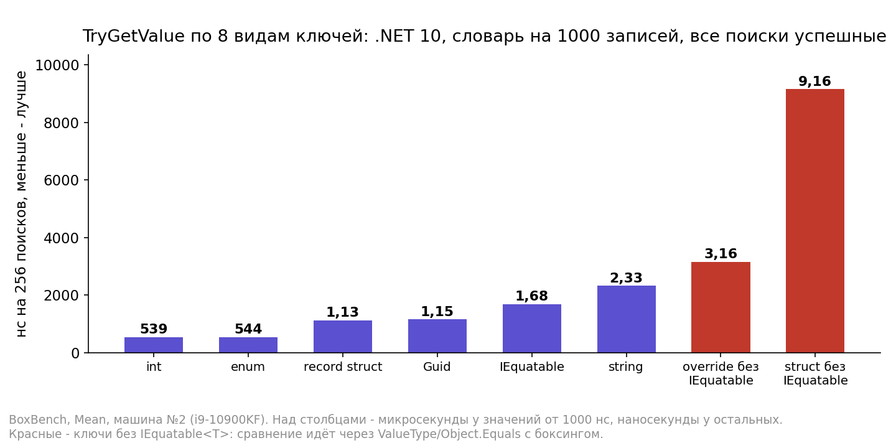
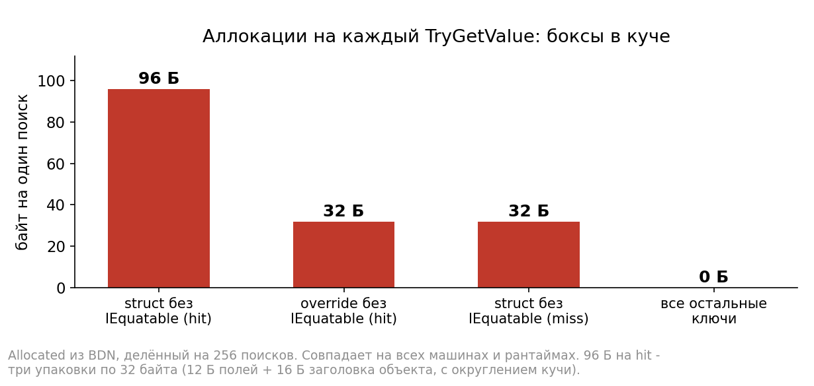
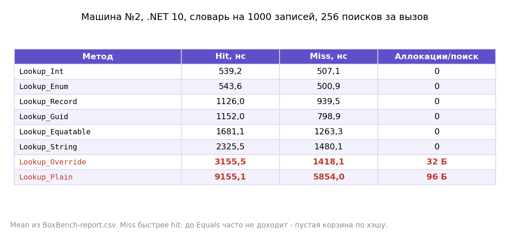
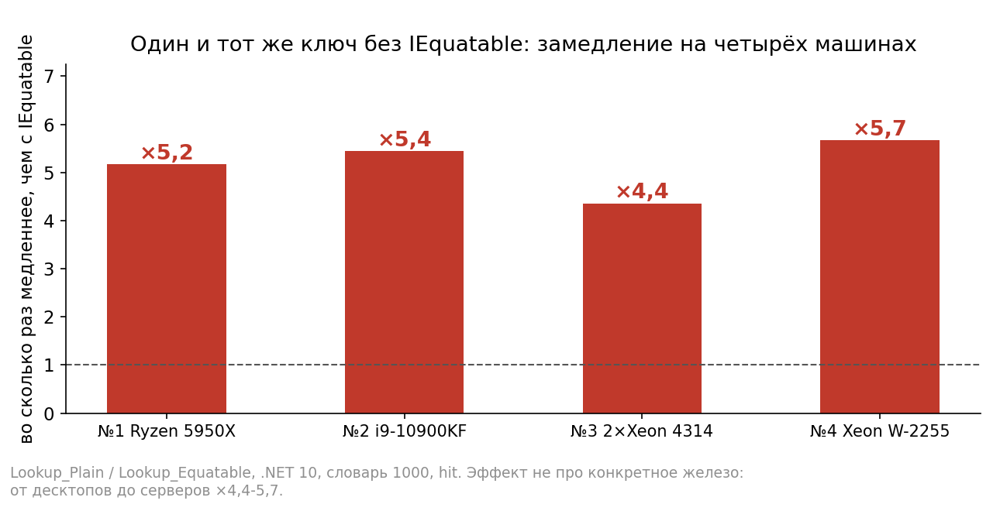
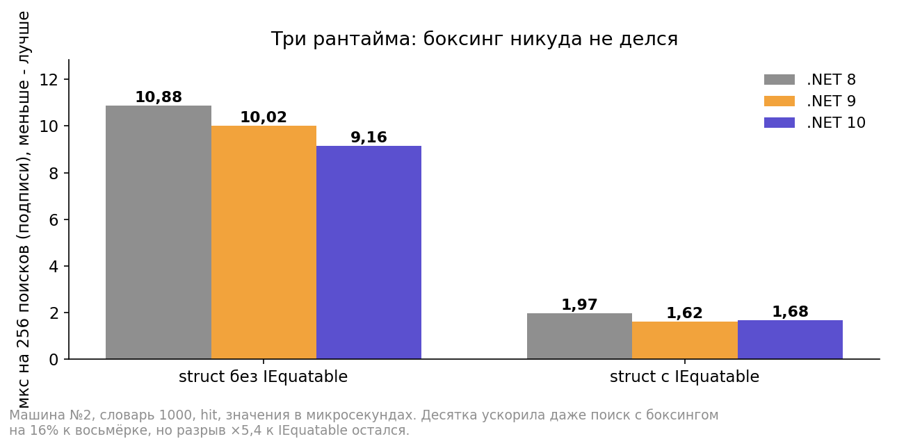

# BoxProof

Скрытый боксинг struct-ключей в Dictionary. Если ключ-структура не реализует IEquatable<T>, EqualityComparer<T>.Default использует ObjectEqualityComparer: сравнение идёт через ValueType/Object.Equals, хэш — через ValueType.GetHashCode, и на каждый поиск структура пакуется в кучу.

Итог на четырёх машинах и трёх рантаймах: struct-ключ без IEquatable медленнее варианта с ним в 4,4–5,7 раза и аллоцирует 96 байт на каждый успешный TryGetValue — ровно три упаковки по 32 байта (12 байт полей + 16 байт заголовка объекта, с округлением кучи). Override Equals без IEquatable проблему не решает: ×1,4–2,4 и 32 байта на поиск — одна упаковка аргумента Equals(object). Record struct оказался быстрее варианта с IEquatable на 33–42%, но разница в хэш-функции, а не в типе: каскад с множителем -1521134295, который компилятор генерит для record, работает быстрее HashCode.Combine. Контрольный CascadeKey (IEquatable с тем же каскадом) это подтверждает: 1,00–1,04 к record на всех четырёх машинах, вариант с HashCode.Combine отстаёт от обоих в 1,5–1,7 раза. Enum-ключ не боксится и идёт наравне с int. С .NET 8 по .NET 10 поиск с боксингом ускорился на 16%, разрыв ×5 остался — рантайм закрыть его не может, пока тип не реализует IEquatable.

Статья на Хабре: ссылка появится после публикации.

## Что проверяется

8 видов ключей на одном словаре: struct без переопределений (3 int-поля), struct с override Equals/GetHashCode без IEquatable, struct с IEquatable, record struct, enum, Guid, int, string. Плюс контрольный CascadeKey — IEquatable с таким же хэш-каскадом, как у record: проверка, что разница record против IEquatable сидит в хэш-функции. TryGetValue пачками по 256 поисков, hit и miss отдельными параметрами, словари на 16 / 1000 / 100000 записей, seed фиксирован. GlobalSetup сверяет: hit-набор находит все 256 ключей, miss-набор — ноль, иначе падение.

## Графики из статьи











## Пруфы

- Боксинг enum в .NET Framework: [EqualityComparer.cs (mscorlib)](https://github.com/microsoft/referencesource/blob/main/mscorlib/system/collections/generic/equalitycomparer.cs) — тип enum без спец-обработки уходил в ObjectEqualityComparer.
- Современный выбор компаратора по интерфейсам типа: [ComparerHelpers.cs (dotnet/runtime)](https://github.com/dotnet/runtime/blob/main/src/coreclr/System.Private.CoreLib/src/System/Collections/Generic/ComparerHelpers.cs) — enum получает EnumEqualityComparer, тип без IEquatable — ObjectEqualityComparer.
- Сами компараторы (Generic, Object, EnumEqualityComparer): [EqualityComparer.cs](https://github.com/dotnet/runtime/blob/main/src/libraries/System.Private.CoreLib/src/System/Collections/Generic/EqualityComparer.cs).
- Общий путь сравнения: [ValueType.cs](https://github.com/dotnet/runtime/blob/main/src/coreclr/System.Private.CoreLib/src/System/ValueType.cs) — Equals/GetHashCode с побитовым сравнением или рефлексией.
- [Dictionary.cs](https://github.com/dotnet/runtime/blob/main/src/libraries/System.Private.CoreLib/src/System/Collections/Generic/Dictionary.cs) — FindValue, из которого сняты дизасм-листинги.
- [Record types](https://learn.microsoft.com/dotnet/csharp/language-reference/builtin-types/record) — что компилятор генерит для равенства record.
- Контрольный замер CascadeKey: 1,00–1,04 к record на четырёх машинах (.NET 10, словарь 1000), HashCode.Combine отстаёт в 1,5–1,7 раза — `Results/Comp_1..4`.
- Боксинг в Tier1-листинге FindValue: вызовов CORINFO_HELP_NEWSFAST ровно три — бокс под GetHashCode и два на сравнение (Equals(object) пакует и ключ, на котором вызывается, и аргумент) + call ValueType:GetHashCode + call Object:Equals + внутренний хелпер рантайма CanCompareBits — `Disasm/Listings_Comp_1..4`. У IEquatable-ключа в том же FindValue сравнение полей заинлайнено, вызовов нет.

## Как воспроизвести

```
dotnet run -c Release -f net10.0     # BDN: .NET 8/9/10, baseline - int-ключ
Disasm\snap.bat                      # дизасм FindValue по узкому фильтру
```

В дампах метод печатается несколько раз — смотреть последний листинг (Tier1).

## Файлы

- `Models` — ключи-структуры из статьи + контрольный CascadeKey.
- `Enums` — enum-ключ.
- `Subjects.cs` — методы поиска с пруф-ссылками в шапке.
- `Benchmarks/BoxBench.cs` — BDN-набор со сверками.
- `Disasm/` — паспорт железа, прогрев, snap.bat; листинги четырёх машин в `Listings_Comp_1..4`.
- `Results/Comp_1..4/` — BDN-прогоны. Машины: №1 Ryzen 9 5950X, №2 i9-10900KF, №3 — 2 × Xeon Silver 4314, №4 — Xeon W-2255.
- `Results/Docs/` — картинки из статьи.
